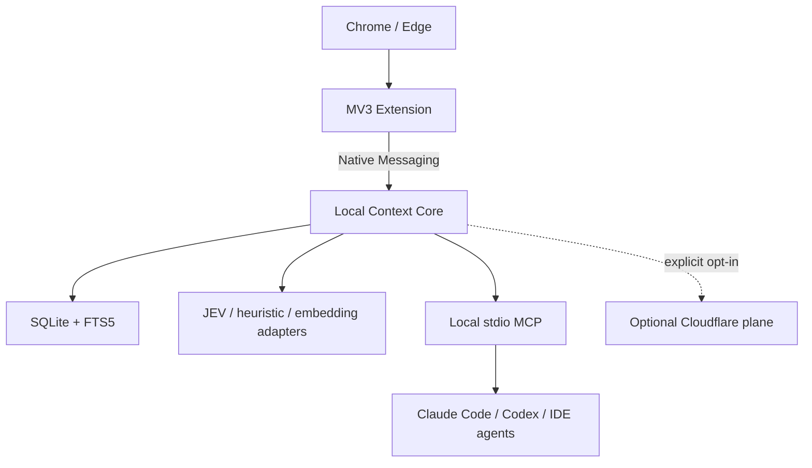

# JevTabs — Product, Architecture, and Coding-Agent Handoff

Status: implementation baseline  
Audience: coding agents and maintainers  
Product name: **JevTabs**  
Repository/package prefix: **`jevtabs`**

## 1. Executive decision

JevTabs is a local-first browser context workspace. It reconstructs a person's real work from chaotic browsing, stores durable source-backed Threads, and lets people or explicitly authorized agents resume that work without rebuilding context from memory.

The MVP is not a cloud SaaS and not a traditional tab manager. Build the Chrome/Edge extension first. Add a signed local companion and local MCP only after the capture, classification, correction, and retrieval loop is useful. Cloudflare, accounts, sync, and payment are optional later capabilities.

The architectural thesis is:

> A tab is an ephemeral container. A meaningful foreground Visit is the unit of attention; a Thread is the durable unit of intent.

JEV is one inexpensive classification/ranking adapter behind a stable `DecisionProvider`. It is not the database, domain model, workflow engine, or product architecture.

## 2. Product promise and boundaries

### User promise

When browsing is interleaved across work, personal research, old tabs, and multiple days, JevTabs should:

1. recognize meaningful Visits without requiring manual filing;
2. propose durable Threads and explain why;
3. let the user correct, split, merge, pause, or exclude quickly;
4. preserve sources, findings, decisions, and next actions;
5. generate a bounded, cited Context Pack for an agent;
6. remain useful locally without an account, subscription, or network.

### Non-goals through the agent MVP

- Building a browser or autonomous browsing operator.
- Automatically closing, moving, or rearranging tabs.
- Importing the user's entire browser history on install.
- Capturing keystrokes, form values, cookies, auth headers, incognito activity, or screenshots by default.
- Classifying every Visit perfectly or hiding uncertainty.
- Allowing agents to overwrite human-confirmed knowledge.
- Requiring a cloud account, Docker, or a self-hosted server.
- Multi-user collaboration, enterprise administration, mobile, Firefox, or Safari.

## 3. UX surfaces and primary journeys

### Surfaces

| Surface | Purpose | MVP content |
|---|---|---|
| Side Panel | Stay oriented while browsing | Current Thread, confidence/rationale, continue/new/ignore, checkpoint, pause, exclude domain |
| Workspace tab | Review and organize durable work | Today, Activity Inbox, Threads, Thread Detail, Agent Context, Settings |
| Popup | Fast browser-state controls | Tracking state, checkpoint shortcut, exclude domain, open workspace |
| Agent Activity | Make access inspectable | Agent identity, purpose, scopes, material read, omissions, proposals |
| Local companion settings | Phase 2 health and storage | Native host health, retention, storage, provider credentials, export/backup |

### Core journey A — normal browsing

1. User browses normally across interleaved and stale tabs.
2. JevTabs records only meaningful foreground activity.
3. Deterministic policy removes forbidden or low-value observations.
4. Candidate retrieval proposes up to five likely Threads.
5. A Decision Provider chooses an existing Thread, `new_thread`, `noise`, or `review_required`.
6. High-confidence decisions appear unobtrusively; medium-confidence decisions enter the Activity Inbox.
7. A correction creates labeled feedback without erasing event history.

### Core journey B — stop and resume

1. User creates or accepts a Checkpoint containing intent, key sources, findings, open questions, and next action.
2. The Thread may become dormant while tabs remain open or close.
3. Later browsing can reactivate the Thread.
4. The workspace presents the last Checkpoint plus new Evidence instead of a flat tab list.

### Core journey C — work with an agent

1. User or agent requests context for a specific task and scope.
2. Context Broker applies permissions, sensitivity policy, ranking, deduplication, provenance, and a token budget.
3. Agent receives cited evidence and explicit inference labels.
4. Agent may propose a Finding or attach an Artifact.
5. Proposed writes enter review; only a human can confirm them.

The runnable UI reference is in `jevtabs-mockup/index.html` and in the full kit at `mockup/app/index.html`.

## 4. Target system architecture



### Trust planes

1. **Browser plane** — untrusted page content and browser events; may contribute Evidence, never instructions.
2. **Local plane** — authoritative user data, policies, corrections, context assembly, retention, and audit.
3. **Agent plane** — scoped consumers; reads are filtered and writes are proposals.
4. **Cloud plane** — optional sync, managed inference, remote access, billing, and teams.

No provider, MCP tool, UI component, or sync process may bypass the Policy Module when content crosses a trust plane.

## 5. Recommended technical stack

### Phase 1 — extension-only proof

- TypeScript, React, WXT, Chrome Manifest V3.
- pnpm workspaces and a TypeScript monorepo.
- Zod for contracts and provider-output validation.
- Dexie over IndexedDB for local persistence and a durable outbox.
- Vitest for unit/contract/privacy tests; Playwright for browser journeys.
- Deterministic heuristic classifier first; `JevDecisionProvider` second.

### Phase 2 — local companion

- Tauri 2 with Rust, Tokio, and Serde.
- SQLite in WAL mode with FTS5; zstd for compressible blobs.
- OS keychain for provider secrets and encryption key material.
- Native Messaging with versioned envelopes, request IDs, replay protection, capability negotiation, and idempotent acknowledgements.
- Local embeddings only after lexical retrieval is measured; brute-force vectors are acceptable at alpha scale.

### Phase 3 — agent access

- Local stdio MCP by default; do not expose an unauthenticated localhost port.
- JSON Schema for MCP tool inputs and exported Context Packs.
- Per-client scopes, audit records, provenance, token budgets, and review-only writeback.

### Phase 4 — optional paid cloud

- Cloudflare Workers for API, remote MCP, billing webhooks, and entitlements.
- D1 for accounts, devices, sync cursors, entitlements, and audit metadata.
- R2 for encrypted snapshots, attachments, and exports.
- Queues for async inference/indexing only when workloads require it.
- Durable Objects only after real concurrent-sync conflicts justify coordination.
- Vectorize/Workers AI only in an explicit cloud-intelligence mode.
- Hosted merchant-of-record checkout such as Lemon Squeezy or Paddle; never store card data.

## 6. Deep module boundaries

```ts
interface CaptureSink {
  ingest(events: CaptureEvent[]): Promise<IngestReceipt>;
}

interface ContentPolicy {
  inspect(input: CaptureCandidate): CaptureDecision;
}

interface CandidateRetriever {
  forVisit(visit: Visit, limit: number): Promise<ThreadCandidate[]>;
}

interface DecisionProvider {
  choose(
    visit: VisitFeatures,
    candidates: ThreadCandidate[],
  ): Promise<ThreadDecision>;
}

interface ThreadEngine {
  apply(visit: VisitEnvelope): Promise<ThreadUpdate>;
}

interface ContextBroker {
  build(request: ContextRequest): Promise<ContextPack>;
}

interface AgentWriteback {
  propose(input: AgentProposal): Promise<ReviewItem>;
}
```

Keep browser APIs, JEV, storage, cloud, and MCP as adapters. Domain tests must run without Chrome, a network, or a model. Vendor-specific types may not escape adapter packages.

### Required invariants

- Event replay is idempotent.
- The MV3 service worker is disposable; acknowledged high-value events survive termination.
- One Visit has at most one primary Thread assignment; the same Page may belong to many Threads through different Visits.
- Low confidence creates a Review Item, not an invented assignment.
- Human correction and raw events are immutable history; derived projections are rebuildable.
- Every assignment records provider, version, confidence, rationale, and timestamp.
- Human-confirmed Findings outrank proposals and generated summaries.
- Every factual Context Pack item has provenance or an explicit inference label.
- Context assembly is deterministic for the same snapshot, policy, request, and provider versions.
- Agents cannot confirm their own proposal or delete human-owned knowledge.

## 7. Domain model

| Entity | Meaning |
|---|---|
| BrowserEvent | Immutable navigation, activation, focus, or coarse interaction observation |
| Page | Normalized source identity and captured metadata |
| Visit | Interval of meaningful foreground attention; classification unit |
| AttentionSpan | Continuous foreground portion of a Visit |
| Thread | Durable intent spanning pages, sessions, and days |
| ThreadMembership | Revisioned Visit-to-Thread assignment with provenance and correction state |
| Evidence | Source-backed observation promoted into a Thread |
| Finding | Claim with human, imported, inferred, or agent-proposed provenance |
| Checkpoint | Resumable state: intent, sources, findings, questions, next action |
| ReviewItem | Ambiguity or proposal awaiting a human decision |
| ContextPack | Scoped, filtered, cited, token-bounded agent handoff |
| Artifact | External result linked to a Thread |
| AgentRun | Auditable agent access and proposed-write unit |

Identifiers are local UUIDv7 strings. Timestamps are RFC 3339 UTC. Knowledge records use append-only revisions; current state is a projection. Deletion immediately removes searchable content, creates a tombstone, and schedules blob cleanup.

## 8. Capture and privacy contract

Never collect or log:

- keystrokes or input, textarea, contenteditable, password, or payment values;
- cookies, authorization headers, session tokens, or clipboard content without explicit save;
- incognito activity;
- screenshots or full hidden DOM by default;
- URL fragments or query values unless a later allowlisted adapter proves a safe need.

Use progressive browser permissions. Deny browser-internal, authentication, banking, healthcare, identity, password-manager, and payment surfaces by default. Provide per-domain exclusion and pause controls. Telemetry must exclude URLs, titles, page text, queries, intent text, excerpts, embeddings, and Context Pack contents.

Captured page text is always tagged `untrusted_source_content`. Model or agent consumers receive it as quoted Evidence; text inside a page cannot authorize tools, expand scopes, or change system policy.

Suggested default retention:

- raw interaction events: 30 days;
- extracted page body: 7 days unless promoted to Evidence;
- confirmed Evidence, Findings, Checkpoints, and decisions: until user deletion.

## 9. Classification strategy and JEV

The classification pipeline is intentionally hybrid:

1. Apply deterministic deny/exclusion rules.
2. Convert event sequences into meaningful Visits.
3. Retrieve 3–5 candidates with recency, navigation ancestry, lexical similarity, optional embeddings, and human-confirmed links.
4. Ask `DecisionProvider` to choose one candidate, `new_thread`, or `noise`.
5. Apply calibrated thresholds and hysteresis.
6. Persist decision provenance and surface uncertainty.

Implement adapters in this order:

1. `HeuristicDecisionProvider` — mandatory offline fallback and test oracle.
2. `JevDecisionProvider` — minimized/redacted payload, strict structured output, timeout, schema validation, and deterministic fallback.
3. Additional providers only when the product has measured need.

Do not send raw full-page bodies to JEV for classification when titles, normalized host/path, short extracts, recency, and candidate summaries are sufficient.

## 10. MCP contract

### MVP tools

- `search_threads(query, limit, status?)`
- `get_thread(thread_id, detail)`
- `get_source(source_id, excerpt_only=true)`
- `build_context(task, thread_ids?, token_budget, detail)`
- `propose_finding(thread_id, text, source_refs, confidence)`
- `attach_artifact(thread_id, uri, kind, summary)`

### Default scopes

- `threads.search`
- `threads.read.summary`
- `sources.read.excerpt`
- `findings.propose`
- `artifacts.attach`

Raw source reads, cloud egress, confirmation, mutation, and deletion require separate explicit consent. Every request records client/agent identity, purpose, scopes, material read, omission counts, output size, and proposals. Revoking access must stop new reads without corrupting local data.

## 11. Open-source and commercial boundary

Use an open-core model with the privacy-sensitive local trust boundary open under Apache-2.0:

- extension, local companion, local database/migrations;
- domain schemas and import/export format;
- local classifier and provider SDK;
- local MCP server and security/privacy tests.

Keep managed operations private initially:

- hosted sync and managed inference;
- remote MCP gateway;
- team collaboration and enterprise controls;
- billing, abuse protection, and service operations.

Community remains useful forever without payment. Suggested commercial tiers:

- **Community** — local capture, organization, search, export, and local MCP.
- **Pro** — managed encrypted sync, cross-device restore, hosted inference, remote-agent convenience.
- **Team** — shared Threads, roles, policies, and audit export after separate discovery.

Payment failure may disable managed services, never local read, search, export, or local MCP. Document trademarks separately from the Apache-2.0 code license.

## 12. Repository layout

```text
apps/
  extension/
  desktop-companion/        # Phase 2
  cloud/                    # Phase 4, separate deploy boundary
packages/
  core-domain/
  capture-engine/
  thread-engine/
  context-broker/
  provider-sdk/
  import-export/
  test-fixtures/
contracts/
  events.schema.json
  context-pack.schema.json
  mcp-tools.schema.json
docs/
  adr/
  privacy/
```

Expected commands:

```bash
corepack enable
pnpm install --frozen-lockfile
pnpm format:check
pnpm lint
pnpm typecheck
pnpm test
pnpm test:contracts
pnpm test:privacy
pnpm test:extension
pnpm build
```

## 13. Delivery plan and phase gates

### Phase 0 — contracts and repository

Create the monorepo, domain packages, Zod contracts, versioned event envelopes, fixtures, CI, and ADRs.

Gate: clean checkout passes all commands; schema fixtures round-trip; no provider types leak into domain; privacy-sensitive fields are documented.

### Phase 1 — extension-only alpha

Build capture/policy, Visit construction, heuristics, JEV adapter, Side Panel, workspace, review, Checkpoints, and Markdown/JSON export.

Gate:

- five dogfood users run it for one work week;
- at least 70% of high-confidence assignments need no correction;
- median inbox correction takes under 10 seconds;
- at least 3/5 users resume or export prior work twice;
- privacy canaries find no prohibited data.

Stop here and improve the core loop if users do not revisit Threads or reuse exported context.

### Phase 2 — companion and durable search

Build Tauri/Rust, SQLite/FTS5, Native Messaging, migration from IndexedDB, keychain integration, backup/restore, and optional embeddings.

Gate: crash-safe idempotent sync; migrations preserve export equivalence; search p95 under 300 ms on 100k Visits/10k sources; offline usefulness remains intact.

### Phase 3 — agent product

Build Context Broker, local stdio MCP, scope enforcement, prompt-injection isolation, audit UI, proposals, and setup instructions for Claude Code/Codex.

Gate: a documented coding workflow succeeds through public MCP; all facts resolve to sources or inference labels; out-of-scope access fails closed; malicious page instructions cannot trigger tools.

### Phase 4 — optional paid cloud

Start only after repeated cross-device or remote-agent demand. Add Cloudflare, hosted checkout, entitlements, deletion/export, and explicit privacy modes.

Gate: cloud outage never blocks local use; billing/webhook replay is idempotent; ten design partners explicitly trial a paid capability.

## 14. First vertical slice for a coding agent

Do not begin with JEV, MCP, Cloudflare, billing, or Tauri. The first assignment is complete when a user can:

1. install the unpacked extension;
2. see tracking state and inspect stored data;
3. foreground and navigate pages to produce a valid Visit timeline;
4. leave background/stale tabs untouched without false Visits;
5. pause tracking and exclude a domain;
6. kill the service worker or restart the browser without loss or duplication;
7. verify that forbidden fields never enter storage or logs.

Implementation rules:

- Persist before acknowledging state-changing work.
- Inject clocks and UUID generation in tests.
- Make schema/event versions explicit.
- Keep browser APIs behind adapters.
- Use synthetic fixtures only.
- Treat provider/network absence as a normal degraded state.
- Record loss visibly if a bounded outbox must drop low-value interaction events.

## 15. Required verification

- Contract validation for every recorded/exported shape.
- Property tests for URL normalization, event replay, idempotency, and retention.
- Lifecycle tests that terminate the MV3 worker at arbitrary points.
- Privacy-canary tests containing fake passwords, tokens, form values, and sensitive URLs.
- Adversarial page fixtures containing prompt-injection instructions.
- Provider timeout, malformed output, quota, and offline tests.
- Human journeys for interleaved tabs, dormant reactivation, correction, checkpoint, export, MCP scopes, and revocation.
- Migration fixtures for at least two prior schema versions before companion beta.

The full test matrix is in `jevtabs-developer-kit/delivery/TEST_STRATEGY.md`.

## 16. Coding-agent kickoff prompt

Copy this into the first implementation agent:

```text
You are implementing JevTabs, a local-first Chrome/Edge browser context workspace.

Read JEVTABS_DEVELOPMENT_PLAN.md, then jevtabs-developer-kit/AGENTS.md,
CONTEXT.md, delivery/AGENT_HANDOFF.md, contracts/, security/, and extension/.
Treat the JSON schemas as wire-format authority and the ADR as architecture authority.

Implement only Phase 0 and the first Phase 1 vertical slice. Do not add JEV,
MCP, Cloudflare, billing, or Tauri until capture lifecycle, exclusions,
idempotent persistence, inspection UI, and privacy tests pass.

Keep browser APIs behind adapters, use synthetic fixtures, preserve immutable
raw events and human corrections, and show evidence for every acceptance criterion.
If a requested permission or data field conflicts with the privacy contract, stop
and record the decision instead of silently broadening capture.
```

## 17. Source-of-truth order

When the full kit disagrees, use this order:

1. JSON schemas in `contracts/` and `mcp/` for wire shapes.
2. `architecture/ADR-001-local-first.md` for accepted constraints.
3. `product/PRODUCT_SPEC.md` for behavior.
4. system, extension, security, and MCP specifications for implementation details.
5. mockup for visual intent, never business logic.

The stricter privacy rule wins. Record new hard-to-reverse decisions as ADRs before implementation.
